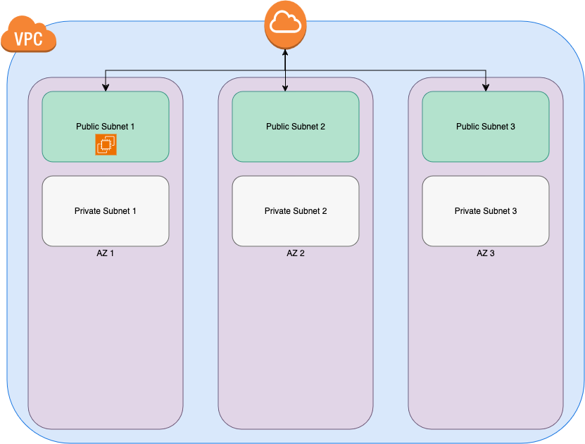

# AWS Instructions

## Prereqs

1. This code is intended to be run using `terraform`  [Install Terraform](https://developer.hashicorp.com/terraform/tutorials/aws-get-started/install-cli)
2. This code will also require AWS CLI to be configured to your AWS account
3. You will need a **terraform.tfvars** file configured in your root directory for this deployment to work out of the box. Use this sample one and it will work without any changes needed. Note it can be configured to satisy your requirements if need be.

```
aws_region           = "us-east-1"
vpc_cidr             = "10.0.0.0/16"
availability_zones   = ["us-east-1a", "us-east-1b", "us-east-1c"]
public_subnet_cidrs  = ["10.0.1.0/24", "10.0.2.0/24", "10.0.3.0/24"]
private_subnet_cidrs = ["10.0.4.0/24", "10.0.5.0/24", "10.0.6.0/24"]
project_name         = "my-project"
environment          = "dev"
default_instance_type= "t2.micro"
tak_instance_type    = "t3.medium"
ubuntu_ami_id        = "ami-04a81a99f5ec58529"  # Ubuntu 20.04 LTS AMI ID
debian_ami_id        = "ami-064519b8c76274859"  # Debian 12 AMI ID
```
## File Structure for AWS Deployment
```
Main
└── aws
    ├── modules
    │   ├── ec2
    │   │   ├── instance
    │   │   │   ├── main.tf
    │   │   │   ├── outputs.tf
    │   │   │   └── variables.tf
    │   │   ├── keypair
    │   │   │   ├── main.tf
    │   │   │   ├── outputs.tf
    │   │   │   └── variables.tf
    │   │   └── security_groups
    │   │       ├── main.tf
    │   │       ├── outputs.tf
    │   │       └── variables.tf
    │   ├── iam
    │   │   ├── main.tf
    │   │   ├── outputs.tf
    │   │   └── variables.tf
    │   ├── s3
    │   │   ├── main.tf
    │   │   ├── outputs.tf
    │   │   └── variables.tf
    │   └── vpc
    │       ├── internet_gateway
    │       │   ├── main.tf
    │       │   ├── outputs.tf
    │       │   └── variables.tf
    │       ├── main.tf
    │       ├── nat_gateway
    │       │   ├── main.tf
    │       │   ├── outputs.tf
    │       │   └── variables.tf
    │       ├── outputs.tf
    │       ├── route_tables
    │       │   ├── main.tf
    │       │   ├── outputs.tf
    │       │   └── variables.tf
    │       ├── subnets
    │       │   ├── main.tf
    │       │   ├── outputs.tf
    │       │   └── variables.tf
    │       └── variables.tf
    ├── playbooks
    │   ├── matrix
    │   │   ├── files
    │   │   │   └── docker-compose.yml
    │   │   ├── main.tf
    │   │   ├── outputs.tf
    │   │   └── variables.tf
    │   ├── openvpn
    │   │   ├── main.tf
    │   │   ├── output.tf
    │   │   └── variables.tf
    │   ├── tak
    │   │   ├── files
    |   |   |   └── takserver-docker-5.1-RELEASE-40.zip
    │   │   ├── main.tf
    │   │   ├── outputs.tf
    │   │   └── variables.tf
    │   ├── traccar
    │   │   ├── main.tf
    │   │   ├── output.tf
    │   │   └── variables.tf
    │   └── ubuntu
    │       ├── main.tf
    │       ├── output.tf
    │       └── variables.tf
    ├── main.tf
    ├── terraform.tfvars
    ├── outputs.tf
    └── variables.tf
```
## Playbook Descriptions

<div align="center">
  <a href="">
    
  </a>
  <br />
  <br />
</div>

These blueprints are meant to demonstrate the deployment capabilities, as well as various services on both Ubuntu Linux, Debian 12, and any other OS of your choice.

