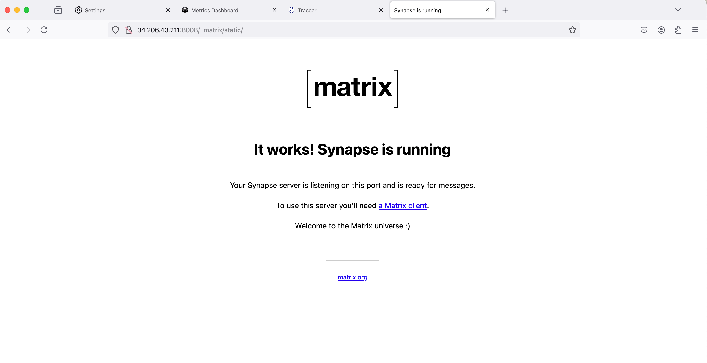

## Matrix
---------------------------
A matrix server, in the context of communication technology, refers to a server that implements the Matrix protocol. 
Matrix is an open standard for decentralized, real-time communication. Our AWS terraform depyloyment of a Matrix server allows
for interchangable OS depending on the users needs. Our current deployment runs on a base Debian 12 and once deployed you can access
the service http://[public-ip]:8008

### Benefits of Matrix server include

 - Decentralization: No single point of failure or control and Users can choose or run their own servers, enhancing privacy and data ownership.
 - Domain: Privacy and Security: End-to-end encryption available for messages and calls. Self-hosting option gives complete control over data.
 - Data Ownership: Users retain control of their data, especially when self-hosting.
 - Scalability: Can handle small to large-scale deployments.
 - Customization: Open-source nature allows for customization to specific needs

### Prereq Instructions:
We assume you have these 4 files , main.tf, variables.tf, and outputs.tf will be automatically in the root directoy when you download the repo. You must create terraform.tfvars file and place it in the root directory as well.

 - main.tf
 - variables.tf
 - outputs.tf
 - terraform.tfvars

To run

1) aws configure (configure your aws account)
2) terraform init
3) terraform plan
4) terraform apply

To verify your matrix server: http://[public-ip]:8008

  
   
   

