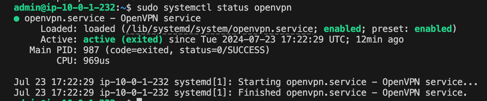

OpenVPN
---------------------------
OpenVPN is a popular, open-source virtual private network (VPN) solution that creates secure point-to-point or 
site-to-site connections in routed or bridged configurations. It uses custom security protocols that utilize SSL/TLS 
for key exchange, offering strong encryption through OpenSSL library. OpenVPN can traverse network address translators (NATs)
and firewalls, and supports flexible client authentication methods.

It's widely used for remote access, Wi-Fi security, and as a basis for large scale enterprise VPN solutions. 
OpenVPN is compatible with major operating systems including Windows, macOS, Linux, iOS, and Android. 
It offers features like load balancing, failover, and fine-grained access controls. While powerful and flexible, 
it requires some technical knowledge to set up and configure properly. 

Some Benefits of OpenVPN server include

 - Enhanced security: Strong encryption protects data transmissions
 - Privacy: Masks your IP address and online activities.
 - Bypasses geo-restrictions: Access content blocked in certain regions
 - NAT traversal: Can work through firewalls and network address translation
 - Scalability: Suitable for both individual users and large organizations

### Prereq Instructions:
We assume you have these 4 files , main.tf, variables.tf, and outputs.tf will be automatically in the root directoy when you download the repo. You must create terraform.tfvars file and place it in the root directory as well.

 - main.tf
 - variables.tf
 - outputs.tf
 - terraform.tfvars

To run

1) aws configure (configure your aws account), if AWS CLI is configured you can skip this step
2) terraform init
3) terraform plan
4) terraform apply

To verify your **Openvpn** connection server: Note, privatekey.pem is created upon successfull deployment and is used to ssh into all application servers currently.

``` 
ssh -i privatekey.pem admin@[public.ip.provided.in.output]
sudo systemctl status openvpn
``` 

<div align="center">
  <a href="">
    
  </a>
  <br />
  <br />
</div>


