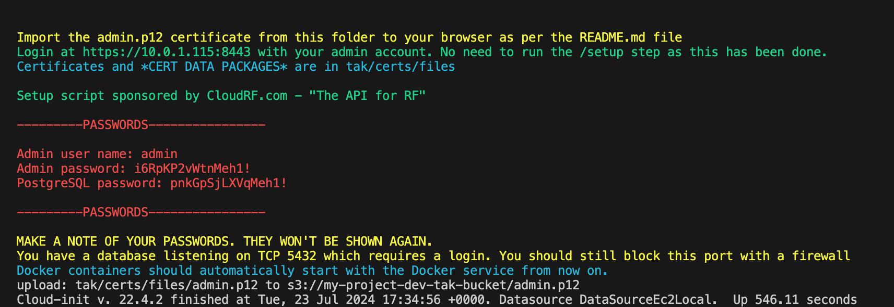
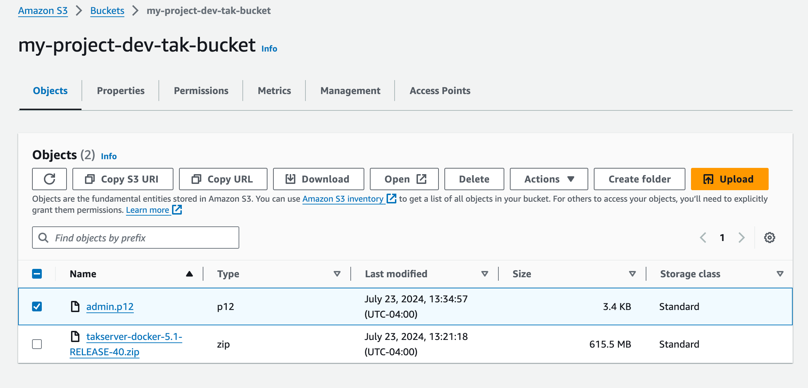
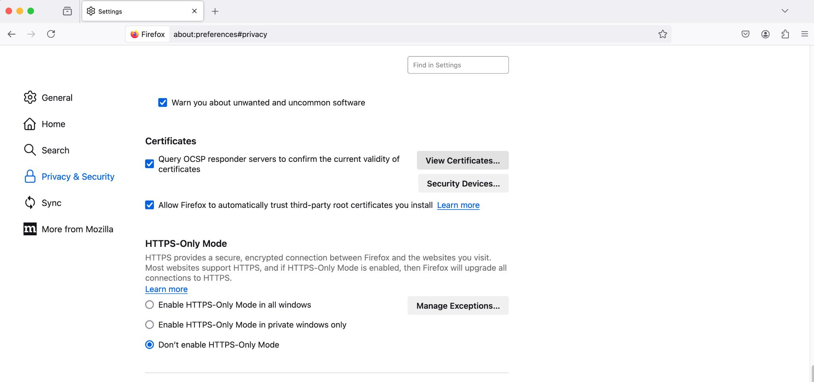
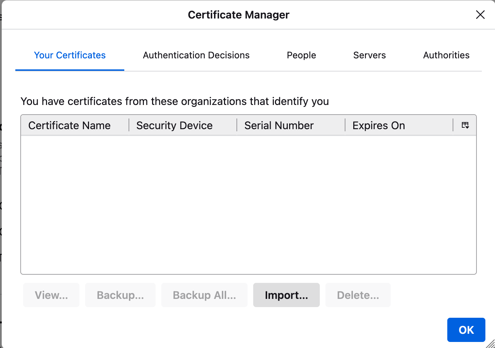
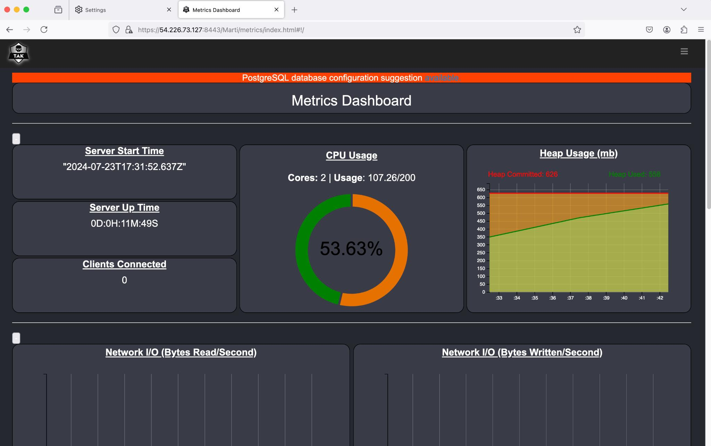

# TAK Server on AWS
---------------------------
TAK is the core of a suite of georeferenced imagery and communications tools that allow for scaled operational planning, data sharing, visualized elevation data, and target management. With TAK, your team can get oriented quickly, make better
informed decisions and quickly respond to threats. Add TAK to your operations, and make sure when your team deploys, you have the unfair advantage.

This containerized deployment is based off of the deployment instructions found on https://tak.gov/ and https://github.com/Cloud-RF/tak-server

### Benefits of TAK server include

 - Enhanced situational awareness: ATAK servers allow for real-time sharing of location data, maps, and tactical information among team members.
 - Flexibility: ATAK can be used on various devices, including smartphones and tablets, making it adaptable to different operational needs.
 - Security: ATAK systems typically incorporate robust security measures to protect sensitive information.
 - Data sharing: It allows for quick and efficient sharing of various data types, including images, videos, and text reports.
 - Planning tools: ATAK includes features for mission planning and execution, which can be accessed and updated in real-time

### Prereq Instructions:
We assume you have these 4 files , main.tf, variables.tf, and outputs.tf will be automatically in the root directoy when you download the repo. You must create
terraform.tfvars file and place it in the root directory as well.

 - main.tf
 - variables.tf
 - outputs.tf
 - terraform.tfvars


## Getting TAK Server

To complete this deployment, you will have to get TAK Server from a valid source. For testing purposes we pulled the docker version from https://tak.gov/products/tak-server, the name
of the file is **takserver-docker-5.1-RELEASE-40.zip**. You must create a account to use this source. 

Once the file is downloaded created you must make a **files** folder location in the **playbook** named **tak**. An example of that file structure will be
   ```  
    │   ├── tak
    │   │   ├── files
    │   │     └── takserver-docker-5.1-RELEASE-40.zip
    │   │   ├── main.tf
    │   │   ├── outputs.tf
    │   │   └── variables.tf
```

Note: **takserver-docker-5.1-RELEASE-40.zip** must be inside of **files** or this will not work.

This build will create a tak server on a base debian 12 image with a tak_instance_type = "t3.medium. However, this can be adjusted in the **terraform.vars** file
To run

### Deploy Instructions:

1) aws configure (configure your aws account)
2) terraform init
3) terraform plan
4) terraform apply

**This process can take up to 5 minutes to deploy so please be patient.**

You can skip this next step but to verify your atak server is up and running. SSH into this machine and run the command

```
tail -f /var/log/cloud-init.log
```
<div align="center">
  <a href="">
    
  </a>
  <br />
  <br />
</div>

Once successful you will need to go to s3 bucket in your aws account that was created and grab the admin.p12 file
<div align="center">
  <a href="">
    
  </a>
  <br />
  <br />
</div>

We use firefox for our tests, so in firefox go to:
 - **Setting**
 - **Privacy Security**, under **Security**, then **Certificates**, you will see **View Certificates** : Click this.
   
<div align="center">
  <a href="">
    
  </a>
  <br />
  <br />
</div>

 - Import that cert, password **atakatak**
<div align="center">
  <a href="">
    
  </a>
  <br />
  <br />
</div>


Now you can go to https://[public_ip_of_atak_server]:8443

<div align="center">
  <a href="">
    
  </a>
  <br />
  <br />
</div>


