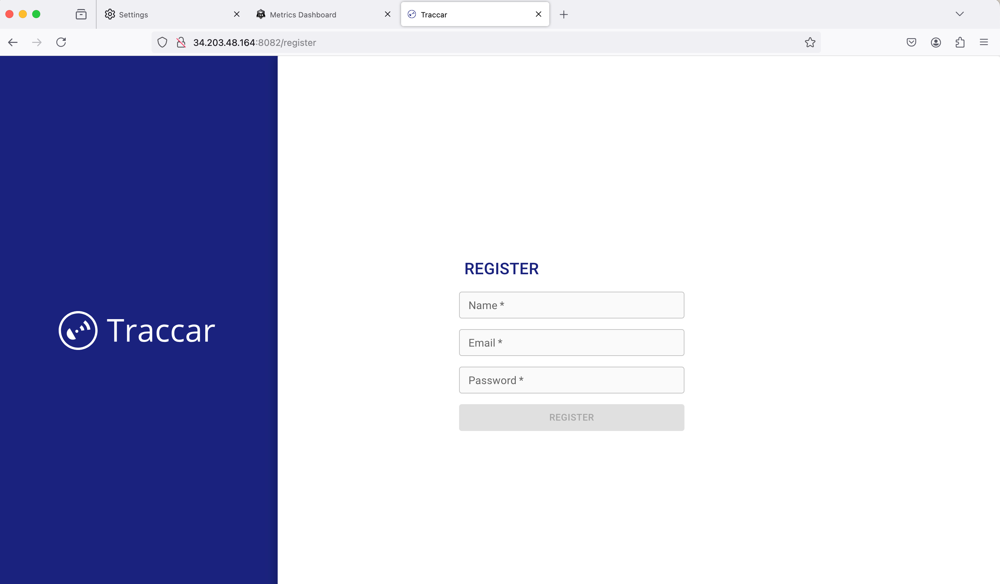
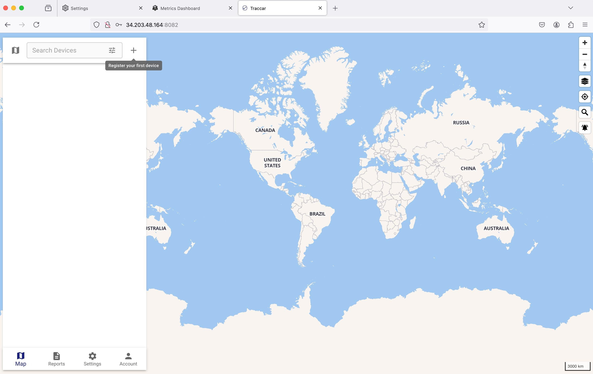

Traccar
---------------------------
Traccar is a server application that collects, processes, and stores location data from various GPS tracking devices. 
Traccar supports over 200 different GPS protocols, making it compatible with a wide range of tracking hardware.
The server provides real-time tracking, historical route playback, geofencing, and alerts. 
It can be self-hosted or used as a cloud service. Traccar offers a web interface for management and monitoring, and also provides mobile apps for on-the-go access.
It's highly scalable, suitable for both personal use and large fleet management. Traccar can integrate with other systems through its API, making it a versatile solution for various tracking needs.

Some Benefits of Traccar server include

 - Wide device compatibility: Supports over 200 GPS protocols.
 - Scalability: Suitable for personal use or large fleets.
 - Customizable: Can be tailored to specific need.
 - Real-time tracking: Live location updates
 - Alerts and notifications: For events like speeding or device issues

### Prereq Instructions:
We assume you have these 4 files , main.tf, variables.tf, and outputs.tf will be automatically in the root directoy when you download the repo. You must create terraform.tfvars file and place it in the root directory as well.

 - main.tf
 - variables.tf
 - outputs.tf
 - terraform.tfvars

To run

1) aws configure (configure your aws account), if AWS CLI is configured you can skip this step.
2) terraform init
3) terraform plan
4) terraform apply

To verify your Traccar server: http://[public-ip]:8082

  
   
   

To login follow instructions, then sign in

  
   
   

