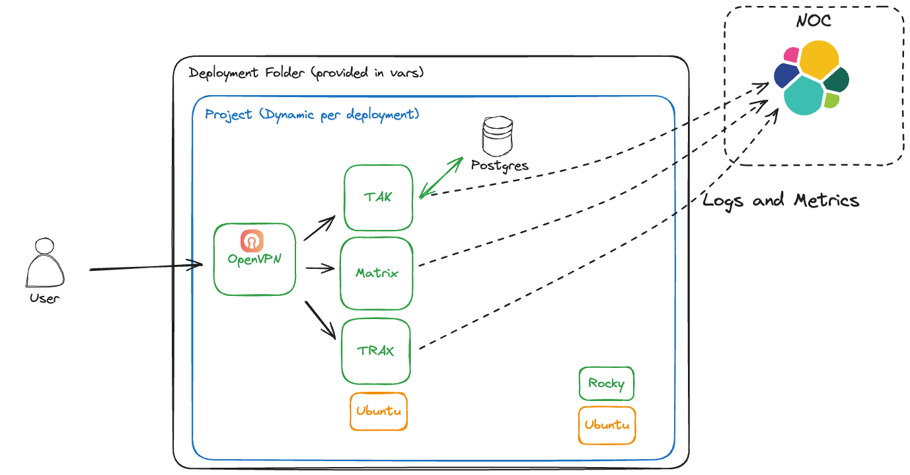

# GCP Instructions

## Prereqs

1. This code is intended to be run using `terraform` but may also be compatible with `tofu`. The team is not testing against `tofu` at this time. [Install Terraform](https://developer.hashicorp.com/terraform/tutorials/aws-get-started/install-cli)
1. Running portions of this code locally may require `gcloud`  [Install gcloud](https://cloud.google.com/sdk/docs/install)

## Authenticating

It is recommended that you run both `gcloud auth login`, `gcloud auth application-default login`, and `gcloud config set project <project>` to make sure that your ephemeral credentials are up to date before running any of the blueprints

## Playbook Descriptions


These blueprints are meant to demonstrate a potential system for deploying OpenVPN, as well as various services on both Ubuntu Linux and Rocky Linux.
In production, we would want to run all of these on the same OS.

### TAK Server

#### Description

This module deploys a new, non-public VPC, with a containerized TAK server deployed to it. For more information, see the README in the blueprint folder


## Modules descriptions

These modules are composable and meant to used in the blueprints/ that are predefined, as well as new blueprints created by customers.

Some of the baseline modules were taken from the [Cloud Foundation Fabric](https://github.com/GoogleCloudPlatform/cloud-foundation-fabric/tree/master/modules), a codebase officially maintained by Google and one that Dark Wolf actively maintains a branch of for DoD specific deployments. Dark Wolf is currently working with the CFF team to upstream our improvements for deploying applications into Assured Workloads environments such as IL4 and IL5.

## Example `.tfvars` file

 Below is an example `terraform.tfvars` file. Replace the values with ones valid for your environment, and place this file into the appropriate subdirectory of playbooks.

```
region     = "us-east4"
prefix     = "mytak"
project_id = "my-first-tak"
project_create = {
  billing_account_id = "123A123-AG12C3-TTY505"
  parent             = "folders/8675309"
}
postgres_user_password = "takpassword"

sql_configuration = {
  availability_type = "ZONAL"
  database_version  = "POSTGRES_13"
  psa_range         = "10.60.0.0/16"
  tier              = "db-g1-small"
}

registry_username        = "your-username"
registry_password_secret = "your-secret"
```
